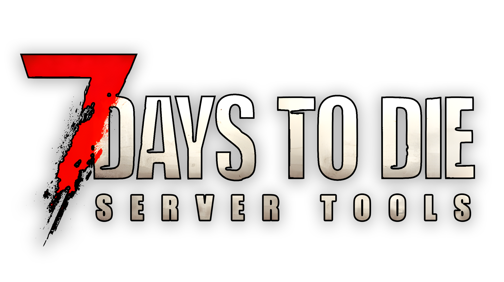

七日杀服务器工具

[//]: # (徽章)

        
        

[//]: # (跳转)

    <a href="#">English Docs</a> | 
    <a href="#">中文文档</a>

[//]: # (功能)

### 开发代办

- [ ] 可视化界面
- [ ] 服务器配置
- [ ] 多服务器支持
- [ ] 自动地图备份
- [ ] 插件

[//]: # (通讯地址)

### 加入讨论

Telegram: [@7DaysToDie-ServerTools](https://t.me/+wMUBqnqWg6MzMGU9)  
Discord: [@7DaysToDie-ServerTools](https://discord.gg/3EeNQWTB)
